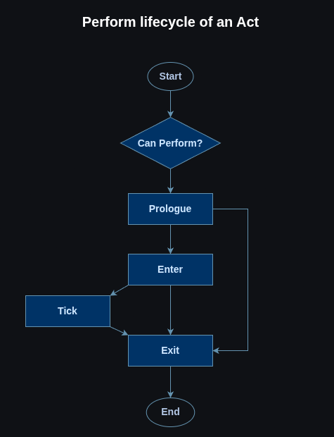
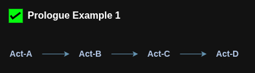
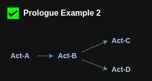
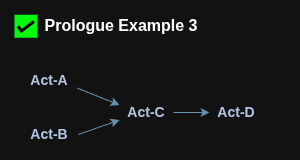
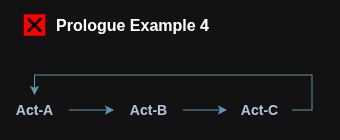
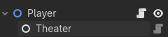

# 🎭 Act Pattern


A game programming pattern for creating and managing complex behaviors with parallelism at its core.


> ### ⚙️ Engine Specific   
> ### 1. [act-godot](https://github.com/ManasMakde/act-godot)  
> 
> (More to be added soon)


## 💡 Principle
The entire pattern revolves around 2 things:
1. **Act:** This is the smallest unit of behaviour that can be carried out in the game e.g. Walk Act, Run Act, Jump Act, Shoot Act, etc.
2. **Theater:** This is responsible for keeping track of all acts and making them tick.

You define your desired behaviour in the `Act`and then "perform" it whenever you want that behaviour to run. The perform follows this lifecycle:  



Since every `Act` is meant to be self-contained they can all perform in parallel (e.g. Look Act, Walk Act & Shoot Act). However, in cases where some acts conflict (e.g. Walk Act & Run Act) or depend on other acts (e.g. Reload Act & Shoot Act) there are 2 mechanisms to handle such situations: **Disabling** & **Prologuing**


### 1. Disabling
Acts can be disabled incase you want to disallow them from performing. If disabled, `Can Perform?` will always return false. The acts can later be re-enabled to allow performing again.


### 2. Prologuing
In situations where an act needs another act to perform before itself, the prologuing mechanism is used.  
Each act has prologue acts i.e. acts that need to be performed before the main act can perform.

<br/>
In example 1, The arrow pointing from an act denotes "who is my prologue" therefore B is a prologue of A and C is a prologue of B and D is a prologue of C. So in this example first D performs then C then B then A

> **Terminology Note:**  
> 1. Act that comes before an act is called **prologue** (e.g. B is a prologue of A)  
> 2. Act that come after an act is called **epilogue** (e.g. C is an epilogue of D)

<br/>

An act (B) can also have more than 1 prologues in such a case both prologues work in parallel (C & D) and only when both have finished does the act (B) perform:  
<br/>

Similarly, An act (C) can have more than 1 epilogues (A & B) and both of them will wait for the prologue (C) to complete first before performing themselves:  
<br/>

Acts cannot however have cyclic prologues:  
<br/>


## 🧭 Usage
> **Note:**  
> All examples are in Godot for simplicity but the concept applies to other engines as well.   
> **For examples in other engines take a look at [Engine Specific Implementations](#-engine-specific)**

### How to create an Act?
Start by extending/inheriting from the `Act` class:
```gdscript
class MyAct extends Act:
```

Now you can implement the desired behaviour by overriding the protected methods or assign values to protected properties. Here are the rules of thumb for each lifecycle method:

1. `_setup()`: Invoked once during initialization
2. `_can_perform()`: Define conditions that allow/disallow performing
3. `_enter()`: Where the actual core logic lives on each perform
4. `_tick()`: Incase the core logic needs continious updates while performing
5. `_exit()`: Used for cleanup after core logic on each perform
6. `_cleanup()`: Invoked once during deinitialization

And here are the rules of thumb for properties:

1. `_can_reperform`: Set true if act is allowed to perform again while already ongoing.
2. `_tick_flags`: The type of ticking (if any) while performing

<br/>

> **Note:**  
> For an act to tick there are 2 conditions:  
> a. The `_tick_flags` must set to something other than `TickFlags.NONE`  
> b. `_enter()` must return `Outcome.NONE`, Returning anything else will immediately lead to `_exit()`


### How to create a theater?
Unlike act, a theater is not meant to be extended instead it needs to be added as a component to the owner (The owner can be anything e.g. Player, AI, Machinery, etc)

```gdscript
class_name Player 
extends CharacterBody2D

@onready var theater:Theater = $Theater
```

<br/>


### How to use Acts and Theater?
Here's an example of a simple platformer character:

```gdscript
class_name Player extends CharacterBody2D

@onready var theater:Theater = $Theater
var walk_act := ExampleActs.MoveAct.new()
var run_act := ExampleActs.MoveAct.new()
var jump_act := ExampleActs.JumpAct.new()
var gravity: float = ProjectSettings.get_setting("physics/2d/default_gravity")

func _ready():

	# Setup Walk
	walk_act.speed = 300.0
	walk_act.init(theater)

	# Setup Run
	run_act.speed = 500.0
	run_act.init(theater)

	# Setup Jump
	jump_act.speed = -400.0
	jump_act.init(theater)

func _physics_process(delta: float) -> void:

	# Gravity & No Slide
	velocity.y += gravity * delta
	velocity.x = 0.0

	# Jump
	if Input.is_action_just_pressed("ui_accept"):
		jump_act.perform()

	# Walk/Run
	var direction := Input.get_axis("ui_left", "ui_right")
	var movement_act := run_act if Input.is_action_pressed("ui_shift") else walk_act
	movement_act.direction = direction
	movement_act.perform()

	# Disable/Enable controls
	if Input.is_action_just_pressed("ui_text_backspace"):
		theater.set_enabled(!theater.is_enabled())

	move_and_slide()
```

> **Note:**  
> You must initialize an act using `init()` before you can perform it.


Here are examples of the acts used:

```gdscript
class MoveAct extends Act:
	
	var speed := 100.0
	var direction := 0.0

	func _can_perform():
		return !is_zero_approx(direction)
	func _enter():
		get_owner().velocity.x = direction * speed
		return Outcome.SUCCESS
	func _exit():
		direction = 0.0
class JumpAct extends Act:
	
	var speed := -400.0
	var direction := Vector2.ZERO

	func _can_perform():
		return get_owner().is_on_floor()
	func _enter():
		get_owner().velocity.y = speed
		return Outcome.SUCCESS
```


## ❤️ Sponsors

If this programming pattern has been useful in your projects consider supporting its development.  
Any support motivates to keep the project well maintained, documented and growing.


## 🔑 License

MIT © [Manas Ravindra Makde](https://manasmakde.github.io/)


[khans-algo]: https://www.youtube.com/watch?v=cIBFEhD77b4
[clique-wiki]: https://en.wikipedia.org/wiki/Clique_(graph_theory)
